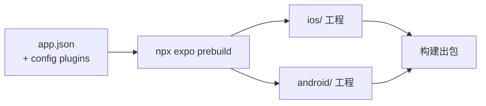

# React Native + Expo：移动端 App 技术分享

移动端技术选型：原理与取舍

<!--
今天讲一个选型问题：移动端为什么选 React Native 加 Expo，而不是 H5 或纯原生。重点讲原理，不教写代码；非前端同学也能跟上，用到的行话我都会现场解释。全场四十五分钟左右。
-->

---

## 这场分享，沿行业走过的路展开

  
<b style="font-size:1.08rem;white-space:nowrap">原生</b>

  →
  
<b style="font-size:1.08rem;white-space:nowrap">H5 / Hybrid</b>

  →
  
<b style="font-size:1.08rem;white-space:nowrap">React Native</b>

  →
  
<b style="font-size:1.08rem;white-space:nowrap">Expo</b>

  →
  
<b style="font-size:1.08rem;white-space:nowrap">边界与结论</b>

<!--
今天不按功能清单讲，按行业走过的路讲，一共五站：最早只有纯原生，太贵；然后是 H5 和 Hybrid 的降本浪潮，撞了天花板；2015 年 RN 诞生，十年把架构重写了一遍；Expo 把它工程化到能落地；最后划边界、给结论。这条线每一章开头都会再出现，走到哪一站一看便知。开讲之前，先立一个贯穿全场的分析框架。
-->

---

## 一套业务，要同时进入两个封闭生态

  
<b>一套业务</b><small>每周都要往前走</small>

  →
  

    
<b>iOS 生态</b><small>Objective-C / Swift · App Store</small>

    
<b>Android 生态</b><small>Java / Kotlin · 各大应用商店</small>

  

两个生态互不认对方的代码——怎么用最少的人进去，还不拖慢迭代？

<!--
先看局面：iOS 是 Objective-C/Swift 那套，Android 是 Java/Kotlin 那套，两个生态互不认对方的代码；业务只有一套，还要每周往前走。移动端所有选型都在回答同一个问题：怎么用最少的人，把一套业务塞进两个封闭生态，还不拖慢迭代。这个问题太大，先把它拆成两个具体问题——就是贯穿全场的分析框架。
-->

---

## 所有界面技术都在回答同样两个问题

  

    

    

    
① UI 由谁渲染

    
系统控件

    
网页引擎

    
② 逻辑跑在哪个运行时

    
JS 运行时

    
原生运行时

    
<b>？</b><small>系统控件 · JS 逻辑</small>

    
<b>纯原生</b><small>系统控件 · 原生逻辑</small>

    
<b>H5 / WebView</b><small>网页引擎 · JS 逻辑</small>

  

<!--
界面技术五花八门，剥开壳都在回答两个问题：屏幕上的按钮是谁画的——系统控件还是网页引擎；业务逻辑跑在哪——原生运行时还是 JS 引擎。两个问题就是这张图的两条轴，答案一组合，所有方案都能放进图里，全场都用它定位。右上角是纯原生：两个答案都选原生，体验顶格，代价下一章算。左下角是 H5：都选网页，成本最低，天花板第三章推导。注意左上角：系统控件的体验，配 JS 的逻辑——这个组合长期没人真正做到，一直空着。记住这个空角，故事讲到一半它会被填上。
-->

---
layout: section
---

# 同一个功能，永远要写两遍

  原生→
  H5 / Hybrid→
  React Native→
  Expo→
  边界与结论

<!--
故事从起点讲起。智能手机头几年，App 只有一种写法：纯原生。体验没得挑，问题出在账上——这章短，就两笔账。
-->

---

## 双份代码、双份团队、双份测试，两端还会对不齐

  
<b>iOS</b><small>Swift · 团队 A · QA 一遍</small>

  

    
同一个需求

    
⇄

    
做出来不一样

  

  
<b>Android</b><small>Kotlin · 团队 B · QA 再一遍</small>

<!--
第一笔账：同一个需求 Swift 写一遍 Kotlin 再写一遍，两拨工程师、两套招聘、QA 各回归一遍。而且两边各自实现，做出来必然有出入：产品某天发现 iOS 有的功能 Android 没有，再补排期。人力乘二，速度除二。
-->

---

## 改一行代码，也要等商店审核

  

    
原生

    
打包

    →
    
<b>商店审核</b><small>iOS 通常 1~3 天</small>

    →
    
放量

    →
    
等用户升级

  

  

    
Web

    
部署

    →
    
分钟级全量

  

<!--
第二笔账：节奏被商店锁死。打包、提审——iOS 通常一到三天，被拒重排——再分批放量、等用户升级。原生团队都攒版本，两周一班车，线上 bug 最快也是天级响应。太贵、太慢，怎么办？行业的第一反应：把已经会的 Web 搬进 App。
-->

---
layout: section
---

# H5 的优点真实存在

  原生→
  H5 / Hybrid→
  React Native→
  Expo→
  边界与结论

<!--
原生的账算完了：太贵、太慢。于是行业往下一站走——把已经会的 Web 搬进 App，这就是 H5 和 Hybrid 的浪潮。公平起见先把优点说足——它们实打实省钱，这也是这条路当年席卷行业的原因；把优点看清楚，才能准确说出它输在哪。
-->

---

## 一套代码两端运行，发版不经过商店

  

    
<b>一份 H5 代码</b>

    ↓
    

      
iOS

      
Android

      
浏览器

      
小程序

    

    
真跨平台

  

  

    
<b>改完部署</b>

    ↓
    
<b>用户打开即新版</b>

    
零审核 · 零等待

  

<!--
两大优点。真跨平台：一份代码处处能跑，今天讲的方案里唯一做到的。发版零成本：部署完用户打开就是新版——正好治上一章「等审核」的痛。运营活动页用它是碾压级优势。那为什么主流 App 的主体都不是 H5？因为它头上有两个天花板。
-->

---

## H5 的头上有两个天花板：体验，和能力

  
<b>体验天花板</b><small>一条标尺 · 三条根源</small>

  
<b>能力天花板</b><small>沙箱隔离 · 依赖原生救场</small>

<!--
两个天花板，分开论证，这一章的结构就这两块。体验这块我不打算说「H5 慢」就完事——那种结论换个引擎版本就过期了。我先立一条标尺：「帧」到底是什么，超时会怎样；再拆三条根源，说清差距从哪儿来。提前说明一件事：这三条不是 H5 的罪状清单，是任何界面技术都要过的三道关——今天先用它们量原生和 Web，第三站我们会用同一张表给 RN 打分。能力那块：为什么纯 H5 连很多功能都做不了——两页推到 Hybrid，再算一笔账。最后收一个分工结论。
-->

---

## 先立标尺：一帧要么准时，要么整帧作废

  

    

    

    

    
VSync 0

    
16.7ms

    
33.3ms

    
15ms 完工

    

      
JS 3ms

      
布局 · 绘制

      
合成

    

    
✓ 准时上屏 —— 延迟 16.7ms

    
JS 多花 3ms

    

      
JS 6ms

      
布局 · 绘制

      
合成

    

    

    
只超了 1.3ms

    

    
整帧作废，屏幕把上一帧再放一遍

    
✗ 延迟 33.3ms

    
120Hz

    

    

    

    

    

    

    
同一段时间里有 4 个截止点，每个只剩 8.3ms —— 上面那条「准时」的 15ms 帧，在这里第一个就过不了

  

掉一帧的代价不是「晚一点」，是延迟翻倍——这是悬崖，不是斜坡

<!--
先立标尺，后面三条根源都用它计价。屏幕不是连续在动的，它像放电影：每隔固定时间取一张画面播出去，这个节拍叫 VSync，60Hz 就是每 16.7 毫秒一次。看上半部分：这一帧 15 毫秒干完了活，赶在截止点之前交卷，准时上屏，用户感知到的延迟就是 16.7 毫秒。看下半部分：同样的工作量，只因为 JS 多花了 3 毫秒，总耗时 18 毫秒——注意，它只超了 1.3 毫秒。关键在这儿：屏幕不会「晚 1.3 毫秒」等你，它到点就取画，你没交卷，它只能把上一帧原样再放一遍；你这一帧不是迟到，是彻底作废，要等下一个刷新周期才有机会上屏。所以超时 1.3 毫秒的实际代价是延迟从 16.7 跳到 33.3——翻倍。这就是「悬崖，不是斜坡」：性能在截止点两侧不是连续变化的，差一点点和差很多，用户感受完全一样。也正是因为这个，「偶尔卡一下」的观感永远比平均帧率的数字难看得多——这条线我们最后一章还会回来算账。最下面那条是 120Hz 的刻度，先留个印象：同一段时间要卡 4 次点，每次只有 8.3 毫秒，上面那条「准时」的帧到这儿直接变成掉帧。
-->

---

## 根源一：通用性的租金，每一帧都要交

  

    

      
原生

      
给字段赋值<small>view.frame = …</small>

      →
      
提交 layer tree

      →
      
上屏

    

    

      
Web

      
DOM

      →
      
Style<small>选择器匹配 · 级联 · 继承</small>

      →
      
Layout

      →
      
Paint

      →
      
Composite

    

  

  
<b>一个 UIView</b><small>≈ 一个对象</small>

  vs
  
<b>一个 &lt;div&gt;</b><small>≈ Node + LayoutObject + PaintLayer …</small>

CSS 是一个通用约束求解器：它能表达的，远超你这个界面实际需要的 这份通用性不是启动时付一次，是<b style="color:#17324d">每一帧都在收租</b>

<!--
第一条根源：抽象层的通用性代价。原生这边，更新一个视图基本等于给结构体字段赋个值，然后把 layer tree 提交给系统——就这么两步。Web 这边，同样一件事要从 DOM 出发，先算样式：选择器要匹配、要级联、要处理继承；再算布局、绘制、合成。为什么这么长？因为浏览器不知道你要渲染什么。CSS 本质上是一个通用约束求解器，它必须能表达任意网页——文档流、浮动、表格、绝对定位、层叠上下文全都得支持。你这个界面可能只用到十分之一，但求解器不会因此变简单。这就是通用性的租金，而且它不是启动时付一次，是每一帧都在收。内存这边也是同一回事：一个 UIView 差不多就是一个对象；一个 div 背后是 Node、LayoutObject、PaintLayer 一串对象。所以呢？回到刚才那条 16.7 毫秒的线——这条根源不直接制造卡顿尖峰，它抬高的是你每一帧的基础成本，把余量吃掉，让你更容易撞线。这是三条里最容易被优化手段缓解的一条，也是最不致命的一条。至于 RN 在这条上站哪儿，先留个空——第三站回来填。
-->

---

## 根源二：关键路径上，有没有一个会被业务代码堵住的单线程

  

    

      
原生

      
主线程卡死 500ms

      →
      
<b>动画照样跑完</b><small>iOS：Core Animation 在独立的 render server 进程 Android：5.0 起有 RenderThread</small>

    

    

      
Web

      
JS · 样式计算 · 布局<small>共享同一个主线程</small>

      →
      
纯 transform / opacity<small>合成线程能独立跑</small>

      →
      
但只要有非 passive 的 touch 监听，或动了触发 layout 的属性<small>全部回到主线程</small>

    

  

再叠加 GC 停顿：垃圾回收什么时候来，你的业务代码说了不算 <b style="color:#17324d">原生的流畅有下限保证，Web 的流畅是概率性的</b> 这个区别，比任何一张平均帧率对比表都重要

<!--
第二条根源，三条里最重要的一条：关键路径上，有没有一个会被业务代码堵住的单线程。原生做了一件很关键的事——它把「动画的执行」从「应用的逻辑」里摘出去了。iOS 上 Core Animation 的动画实际是在一个独立的 render server 进程里推进的；Android 从 5.0 起有 RenderThread。所以你的主线程哪怕卡死 500 毫秒，那个动画该怎么播还怎么播完，因为播它的根本不是你这个线程。Web 这边相反：JS、样式计算、布局共享同一个主线程。有人会说浏览器不是有合成线程吗——对，纯 transform 和 opacity 的动画合成线程确实能独立处理，这是真本事。但这条逃生通道很窄：只要页面上挂了非 passive 的 touch 监听，浏览器就必须先问过主线程才敢滚；只要你动的属性会触发 layout，也一样得回主线程。再加上 GC——垃圾回收什么时候来、停多久，你的业务代码控制不了。所以呢？这就是今天最该记住的一句话：原生的流畅是有下限保证的，Web 的流畅是概率性的。你在自己手机上测一百次都不掉帧，不代表用户那一次不掉——因为它取决于那一刻主线程上恰好有什么。这个区别，比任何一份平均帧率对比表都重要。
-->

---

## 根源三：交互的物理，是系统在驱动，还是你在模拟

  

    
滚动减速曲线 · 边界回弹

    
嵌套滚动的仲裁

    
侧滑返回的手势优先级

    
点击的即时高亮

    
系统在合成线程 / 事件层直接驱动

  

  ←
  

    
<b>触摸屏原始采样</b><small>常见 240Hz，是刷新率的 2~4 倍 带硬件时间戳 · 能看见 VSync 信号本身</small>

    
↓

    

      
<b>系统</b><small>拿到一手数据</small>

      
<b>JS 层</b><small>打包 · 降采样 · 加过延迟</small>

    

  

最典型的一处：抬手瞬间的甩动速度——系统用抬手前一小段高频采样做加权拟合，还要滤掉手指离开时不自觉的回缩；JS 只能拿最后两三个稀疏事件点做差分 <b style="color:#17324d">这不是算得慢，是输入数据的精度就不够——优化不掉，因为差距在信息层面</b>

<!--
第三条根源最容易被忽略，却是用户说「感觉不对」时的主因：交互的物理由谁驱动。原生的滚动减速曲线、边界回弹、跟手性、两层列表同时能滚时谁该响应、侧滑返回和横向滚动打架时谁优先、手指按下去那一瞬间的高亮——这些全部是系统在合成线程和事件层直接驱动的，App 一行代码都不用写。H5 这边，稍微复杂一点的交互就得 JS 自己模拟。为什么模拟不像？很多人以为是算法不够好，其实更深一层是信息不对称。看右边：触摸屏的原始采样率常见 240 赫兹，是刷新率的两到四倍，每个点还带硬件级时间戳，系统还能直接看到 VSync 信号本身。而 JS 拿到的是什么？是已经被打包、降采样、还加过一段延迟的二手数据。最典型的例子是抬手那一瞬间的甩动速度估计：系统用抬手前一小段高频采样点做加权拟合，还要专门滤掉手指离开屏幕时不自觉的回缩；JS 只能拿最后两三个稀疏事件点做差分——手指回缩那一下正好被算进去，甩出来的速度就偏了。所以呢？这不是算得慢，是输入数据的精度就不够。这条优化不掉，因为差距在信息层面，不在计算层面。三条根源讲完：H5 三条全在下风——不是没优化好，是结构性的。注意每条我都留了一格空白：RN 站哪儿？第三站回来填这张表。现在换第二个天花板：能力。
-->

---

## WebView 是一个沙箱，系统能力都在沙箱之外

  
<b>WebView 沙箱</b><small>网页 JS 被关在这里</small>

  

  

    
摄像头

    
推送

    
蓝牙

    
文件系统

  

墙是浏览器安全模型砌的——所以纯 H5 的 App 并不存在

<!--
能力天花板。浏览器天生不信任网页，把它关在沙箱里——摄像头、推送、蓝牙都碰不到。但正经 App 离不开这些。所以只要一个「H5 App」能扫码、能收推送，它就一定不是纯 H5，原生代码一定在场。这就是 Hybrid。
-->

---

## 所谓的「H5 App」，实际都是 Hybrid

  

    <b style="margin-bottom:.5rem">原生壳</b>
    

      
<b>WebView</b><small>H5 页面 + JS</small>

      

        
JSBridge

        
异步 · 字符串 · 无类型

        
⇄

      

      

        
摄像头

        
推送

        
蓝牙

      

    

  

<!--
Hybrid：原生壳管系统能力，WebView 跑页面，中间 JSBridge 通道让网页喊话。注意桥上三个标签——异步，要等回调；字符串，参数序列化传；无类型，全靠口头约定，一边改了另一边上线才发现。下一页看这三个标签变成多少工作量。
-->

---

## Hybrid 并没有省掉原生开发

  

    
原生写实现

    →
    
注册到桥

    →
    
JS 封装调用

    →
    
两端联调

  

  
每加一个能力走一遍；iOS 和 Android 的桥不同，各走一遍

<!--
每加一个原生能力：原生写实现、注册到桥、JS 封装、联调——iOS 和 Android 各来一遍。所以 Hybrid 团队照样要养原生工程师维护壳和桥。原生开发没省掉，只是挪了个位置。Hybrid 是务实折中，但没解决「两个生态两套人」的根本问题。
-->

---

## H5 适合嵌入页面，不适合承担 App 主体

  

    <b>App</b>
    

      
<b>主体验</b><small>首页 · 核心流程 · 高频交互</small>

      

        
运营页 H5

        
活动页 H5

        
帮助中心 H5

      

    

  

<!--
两个天花板都到底了，结论是分工：低频、重展示、天天改的页面给 H5，发版优势用在刀刃上；主体验——首页、核心流程、高频交互——被体验和能力两个天花板压着，不该是 H5。行业在这条路上摸了好几年，最大的一跤是 Facebook 摔的，这个故事马上讲。
-->

---

## 我们想要的是：原生的体验，Web 的开发效率

  
原生的体验

  +
  
一套 JS 代码

  +
  
Web 的开发效率

  →
  
<b>React Native？</b>

<!--
把两章的账合起来，需求清单自己浮出来：原生的体验、一套 JS 代码、尽量保住 Web 的开发效率——说白了，就是要填上开场坐标系里那个空角。听着像既要又要——2015 年，Facebook 交出了一份答卷。
-->

---
layout: section
---

# RN 的原理：JS 负责计算，原生负责渲染

  原生→
  H5 / Hybrid→
  React Native→
  Expo→
  边界与结论

<!--
原生太贵，H5 撞了天花板——演进到第三站，Facebook 交的答卷：React Native。全场最重的一章，先用一句话说清它是什么、看它从哪来，再把它拆开证明。
-->

---
layout: center
class: text-center
---

## RN 用 JS 描述界面，渲染出来的是真原生控件

  
<b>JS</b><small>描述界面</small>

  →
  
<b>React Native</b>

  →
  
<b>原生控件</b><small>系统渲染</small>

<!--
RN 的答案就这一句：用 JS 描述界面，渲染出来的是货真价实的原生控件——开场坐标系里那个空角，它站进去了。注意，没有网页、没有套壳，屏幕上每个按钮都是系统亲手画的，JS 只是发号施令的人。这句话现在还是个断言，这一章把它拆开证明，最后用系统工具现场验货。
-->

---

## RN 不是新技术：它已经演进了十年

  

    
2012

    
<logos-facebook style="width:1.9rem;height:1.9rem" />

    
弃用 HTML5<small>Facebook 全线退回原生</small>

  

  

    
2015

    
<logos-react style="width:1.9rem;height:1.9rem" />

    
React Native 开源<small>用 JS 指挥原生控件</small>

  

  

    
2018

    
<carbon-tools style="width:1.8rem;height:1.8rem;color:#6b7280" />

    
启动架构重写<small>拆掉那座异步桥</small>

  

  

    
2019

    
<carbon-flash style="width:1.8rem;height:1.8rem;color:#b45309" />

    
Hermes 引擎<small>为手机自研</small>

  

  

    
2024

    
<carbon-checkmark-filled style="width:1.8rem;height:1.8rem;color:#047857" />

    
新架构成为默认<small>Fabric + JSI</small>

  

  

    
未来

    
<carbon-rocket style="width:1.8rem;height:1.8rem;color:#6b7280" />

    
Static Hermes<small>JS 编译成机器码 React Compiler 等</small>

  

十年、四次架构级演进，由 Meta、微软、Expo 多方共建——不是新玩具

<!--
上一章说行业在 H5 上摔的最大一跤：2012 年扎克伯格公开承认「押注 HTML5 是我们犯过的最大错误」，Facebook App 全线退回原生。但成本问题还在，2013 年内部 Hackathon 里长出一个实验：用 JS 指挥原生控件——2015 年开源，就是 React Native。之后是一部架构自我革命史：2018 年启动重写，把那座异步桥拆掉；2019 年自研 Hermes 引擎，专为手机做的 JS 引擎；2024 年 10 月起，Fabric 加 JSI 的新架构成为默认。最后一格是路线图，还没落地所以用虚线：Static Hermes 是 Hermes 的下一步，把带类型标注的 JS 提前编译成原生机器码，而不是像现在这样编译成字节码再解释执行，目标是把解释器开销整个去掉；旁边还有 React Compiler，自动做记忆化，省掉手写 useMemo 那一堆。这两个都还没成为默认，但方向很清楚。一句话：它不是新玩具，是演进了十年、还在活跃进化的成熟技术。
-->

---

## 锚点句拆开，是两个要回答的问题

  

    
<b>① 界面的变化，由谁计算</b><small>React 的 diff · Yoga 布局</small>

    
<b>② 计算结果，如何成为控件</b><small>从桥到 JSI · Hermes</small>

  

  
最后验货：视图树里没有一个 div

<!--
回到锚点句——RN 用 JS 描述界面，渲染出来的是真原生控件。把它拆开，其实就两个问题：第一，界面的变化由谁计算；第二，计算结果怎么穿过 JS 和原生的边界、成为屏幕上的真控件。这一章就按这两个问题走，最后用系统工具验货。
-->

---

## React 的输出不是画面，是一份最小差异清单

  

    
<b>旧描述</b><small>数据 A 时的界面</small>

    
<b>新描述</b><small>数据 B 时的界面</small>

  

  →
  
<b>diff</b><small>对比</small>

  →
  
<b>最小差异清单</b><small>这行文字变了 那个按钮没变</small>

到这为止全是内存计算——真正「画」，是下游渲染后端的事

<!--
第一个问题开拆：界面的变化由谁计算？答案是 React，非前端同学给我一分钟。它是描述界面的库：你声明数据长这样时界面该长那样；数据一变，它把新旧描述一比，算出最小差异清单。关键：到这为止全是内存计算，一个像素没画。画是下游「渲染后端」的事——而渲染后端，是可以整个换掉的。这就是 RN 的钥匙。
-->

---

## 同一个 React，换一个渲染后端

  

    
<b>React</b><small>diff 出界面变化</small>

    
↓

    
<b>ReactDOM</b>

    
↓

    
<b>DOM 节点</b><small>浏览器渲染</small>

    
网页

  

  

    
<b>React</b><small>diff 出界面变化</small>

    
↓

    
<b>React Native</b>

    
↓

    
<b>UIView · android.View</b><small>系统直接渲染</small>

    
手机

  

<!--
左边网页：React 算 diff，ReactDOM 落成 DOM，浏览器渲染。右边把 ReactDOM 换成 React Native：同样的 diff，落地变成给原生侧发指令——创建 UIView、改文字。没有 DOM、没有 WebView。锚点句现在有画面了。而且上层都是 React，前端经验直接平移。
-->

---

## 前端写的 flex 布局，由 C++ 引擎 Yoga 计算

  
flexDirection: 'row' justifyContent: 'center'

  →
  
<b>Yoga</b><small>C++ 实现的 Flexbox</small>

  →
  

    
iOS 布局

    
Android 布局

  

同一份实现，两端结果一致

<!--
「计算」的最后一块：位置。原生控件不认识 CSS。RN 内置 Yoga——C++ 重新实现的 Flexbox，前端写惯的 flex 原样生效。C++ 算得快，而且两端跑同一份实现，布局结果完全一致。到这，第一个问题答完了：React 算出变什么，Yoga 算出摆哪里。

-->

---

## 老架构里，三个线程隔着一座异步桥

  
<b>JS 线程</b><small>业务代码 · diff</small>

  

    
JSON 序列化 · 异步 · 攒批发送

    

      

      

    

    
桥（Bridge）

  

  

    
<b>Shadow 线程</b><small>Yoga 算布局</small>

    
<b>UI 主线程</b><small>创建控件 · 上屏</small>

  

与浏览器不同：JS 不和渲染抢线程——JS 忙时，已交给系统的滚动、转场仍由原生驱动 但每帧还要回 JS 取值的动画，依然挂在这条单线程上

<!--
进入第二个问题：这份差异清单怎么穿过 JS 和原生的边界，变成真控件？先看 2015 年初代架构的答案。三个线程：JS 线程跑业务和 diff，Shadow 线程算布局，UI 主线程上屏。这里先兑现根源二的一半：浏览器里 JS 和渲染挤同一个主线程，RN 从第一天起就把它们分开——JS 跑久了不劫持渲染，已经交给系统的列表滚动、转场动画照样由原生线程驱动，最多是数据更新晚到一拍。这条 RN 对 H5 是实打实的赢。但别急着给它打满分：只要一个动画每帧还要回 JS 要一次数值，它就仍然吊在 JS 这条单线程上——根源二那一格 RN 到底算赢算输，这一章结束时用一张表结算。回到图上：中间那座桥是唯一通道，规矩很怪——所有数据序列化成 JSON、全异步、攒批发。每次对话都要打包、排队、解包——什么场景会出事？
-->

---

## 桥上全是序列化消息，高频交互会拥堵

  
<b>触摸事件</b><small>原生侧产生</small>

  

    ⇄
    
桥：序列化 · 排队

    
每秒几十个来回

  

  
<b>JS 算新位置</b>

桥一堵，画面跟不上手指——老 RN「卡」的技术根源

<!--
高频交互。手指拖拽：触摸事件过桥给 JS，JS 算完过桥回原生，每秒几十个来回，每次都序列化排队。桥一堵画面跟不上手指——早年「RN 卡」的传闻就是这座桥。这也是时间线上 2018 年那次手术的动机：Meta 直接把桥拆了。
-->

---

## 新架构移除了桥，换成直通的 JSI

  
<b>JS 线程</b><small>业务代码 · diff</small>

  

    
<b style="font-size:.78rem">JSI</b><small>同步调用 · 零序列化</small>

    
JS 直接持有 C++ 对象引用

  

  

    
<b>Fabric</b><small>新渲染器</small>

    
<b>TurboModules</b><small>原生模块按需加载</small>

    
<b>UI 主线程</b><small>控件上屏</small>

  

RN 0.76 起（2024 年 10 月），新架构默认开启

<!--
手术核心叫 JSI：以前隔桥喊话，现在 JS 直接握着 C++ 对象引用，像调普通函数一样同步调，不序列化不排队。这张图和上一张同构，就是桥换成直通接口。配套 Fabric 新渲染器、TurboModules 按需加载。重点是时间点：0.76 起默认开启，2024 年 10 月——「RN 卡」的老印象，主要对应的就是这座已经拆掉的桥。
-->

---

## Hermes 把 JS 提前编译成字节码

  

    
普通引擎

    
启动

    →
    
<b>现场解析 + 编译</b><small>白屏时间</small>

    →
    
执行

  

  

    
Hermes

    
<b>构建时已编译</b><small>字节码打进安装包</small>

    →
    
启动

    →
    
直接执行

  

启动快，内存省

<!--
第二个问题还剩一块配套：JS 本身在哪跑？这就是时间线上 2019 年那格。一般引擎在用户打开 App 那刻现场解析编译，白屏就耗在这。Hermes 把编译挪到构建时，字节码直接打进包，启动加载即执行——启动快、内存省。RN 的运行时是为手机量身做的，不是把网页那套搬过来凑合。
-->

---

## 视图树是最直接的证据：里面没有一个 div

  

    UIWindow 
    &nbsp;└ RCTRootView 
    &nbsp;&nbsp;&nbsp;&nbsp;└ RCTViewComponentView 
    &nbsp;&nbsp;&nbsp;&nbsp;&nbsp;&nbsp;&nbsp;&nbsp;├ RCTParagraphComponentView 
    &nbsp;&nbsp;&nbsp;&nbsp;&nbsp;&nbsp;&nbsp;&nbsp;└ RCTViewComponentView
  

  

    
全是 UIView 子类

    
div：0 个

  

Xcode View Hierarchy / Android Layout Inspector：直接查看运行中 App 的真实视图层级

<!--
两个问题都答完了，验货。（现场演示，控制在两分钟内）Xcode 掀开视图层级：RCTViewComponentView、RCTParagraphComponentView，全是 UIView 子类，找不到一个 div；Hybrid App 掀开就是一个大 WebView 节点。眼见为实。（演示前在自己 demo 里核对类名，老架构显示的是 RCTView、RCTText。）
-->

---

## 小结：JS 负责计算，原生负责渲染

  
<b>JS</b><small>计算界面变化</small>

  →
  
<b>JSI</b><small>同步送达</small>

  →
  
<b>Yoga</b><small>计算位置</small>

  →
  
<b>系统控件</b><small>渲染上屏</small>

体验是原生的，开发是 JS 的

<!--
章首立的那句话，现在证完了。两个问题串成一条链：JS 算出界面怎么变，JSI 同步送达，Yoga 算出位置，系统控件渲染上屏。体验拿到原生，开发拿到 JS——原理成立。但「接近原生」到底接近到什么程度？第二章留了三格空白，现在有足够的机制去填了。
-->

---

## 三个根源结算：RN 到底买到了什么

<table class="mx">
  <thead>
    <tr>
      <th></th>
      <th class="h-nat">原生</th>
      <th class="h-rn">React Native</th>
      <th class="h-js">H5 / WebView</th>
    </tr>
  </thead>
  <tbody>
    <tr>
      <th>① 抽象层的通用性代价<small>抬高每帧的基础成本</small></th>
      <td>
<b>赢</b><small>赋值 + 提交 layer tree</small>
</td>
      <td>
<b>接近</b><small>Yoga 算完直接设 frame 绕开 CSS，且跑在独立线程</small>
</td>
      <td>
<b>输</b><small>每帧走完整 CSS 管线</small>
</td>
    </tr>
    <tr>
      <th>② 关键路径上的单线程<small>长尾和「偶尔卡一下」的来源</small></th>
      <td>
<b>赢</b><small>动画在独立进程 / 线程</small>
</td>
      <td>
<b>与 H5 同侧</b><small>JSI 大幅改善，但 JS 逻辑仍在单线程上</small>
</td>
      <td>
<b>输</b><small>JS 与渲染共用主线程</small>
</td>
    </tr>
    <tr>
      <th>③ 交互物理由谁驱动<small>用户说「感觉不对」的主因</small></th>
      <td>
<b>赢</b><small>系统拿触摸一手数据</small>
</td>
      <td>
<b>接近</b><small>FlatList 底下是真的 UITableView / RecyclerView</small>
</td>
      <td>
<b>输</b><small>JS 只拿到二手数据</small>
</td>
    </tr>
  </tbody>
</table>

<b style="color:#17324d">RN 在 ① ③ 上买到了原生的东西，在 ② 上和 H5 同侧</b>——选型逻辑的支点 而且只在「每帧都在变」的界面上成立；静态图文页，三者差距基本为零

<!--
这张表是全场的支点，讲慢一点。第一条，抽象层的租金：RN 用 Yoga 算布局，Yoga 是 flexbox 的一个子集，用 C++ 实现，算完直接给原生 view 设 frame——整条 CSS 管线被绕开了，而且 Yoga 跑在独立线程，不占 JS 线程。所以这一条 RN 接近原生。第三条，交互物理：这条 RN 赢 H5 赢得最干脆——FlatList 底下就是真的 UITableView 和 RecyclerView，滚动的减速曲线、回弹、cell 复用，全部是系统那份实现，白送的，不是模拟的。第二条是关键：RN 没有赢过原生。老架构下手势要过异步桥，注意重点不是「过桥慢」，而是「这条路是异步的」——JS 线程正在跑一段 200 毫秒的数据处理，你的手指移动就得排队等它。新架构 Fabric 加 JSI 大幅改善了，同步调用、不用序列化，但 JS 逻辑本身仍然在一条单线程上。所以结论是这样：RN 花钱买到了①和③，但②没买到——它在②上和 H5 是同一侧的。这句话请记住，因为它决定了后面所有的判断：RN 的平均体验很接近原生，但它和原生一样有下限保证吗？没有。第三章开头我说过原生和 Web 的区别是「有下限保证」对「概率性」，RN 在这一点上是概率性的那一边。最后一行也必须说清楚：这三条根源全部只在「每帧都在变」的界面上成立——列表在滚、手指在拖、转场在放。一个静态图文页，进去就不动了，三者差距基本为零。所以这不是「原生更好」的一刀切，是「什么场景下差距才存在」。表里的措辞我用的是赢/接近/同侧，没写具体倍数——因为具体数字随机型、引擎版本、页面复杂度浮动很大，真做决策要自己压测。
-->

---

## 差距为什么落在②：两种动画模型

<DemoFrame src="animation-models.html" :height="292" />

<code>useNativeDriver: true</code>、Reanimated worklet 不是「优化」，是<b style="color:#17324d">从「每帧回问」换成「一次提交」</b>

<!--
（现场演示，两分钟）把第二条根源再挖一层，看这个演示。同一个 0.3 秒的动画，两种做法。上面这条叫「一次提交」，也就是声明式：动画开始的那一刻，把整条曲线——从哪到哪、用什么缓动、放多久——一次性交给合成器，然后应用层就撒手了。看右边跨层通信的计数：1 次，整个动画期间就这一次。下面这条叫「每帧回问」，也就是命令式：每一帧都要回到 JS 问一次「现在该在哪」，通信次数等于帧数，0.3 秒就是十八次。注意，只要线程不忙，这两条路看起来一模一样，所以平时你根本发现不了区别。现在我勾上「让应用线程卡住 200 毫秒」——盯着两个方块：上面那个完全不受影响，照常播完，因为播它的根本不是这条被卡住的线程；下面那个立刻僵住，等线程放开才跳到正确位置。右边的计数也变了：本该十八次，实际只送到六次，中间那十二次全被堵掉了。下面两条时间轴是机制：红色是被阻塞的应用线程，绿色是合成器真正在动的时段——上面那条绿色是连续的，下面那条正好缺了一块，缺口和红色严丝合缝。所以呢？这解释了为什么表里②那一格 RN 是黄的：只要动画每帧还要回 JS 取一次值，它就是「每帧回问」，就吊在那条会被业务代码堵住的单线程上。而 RN 里那两个大家天天写的东西——useNativeDriver 设成 true、Reanimated 的 worklet 把动画代码放到 UI 线程跑——本质都不是「优化参数」，是把这个动画整个从「每帧回问」换成「一次提交」，换的是模型。理解了这一点，你就不用背「什么时候该加 useNativeDriver」这条规则了，你自己能判断：这个动画的每一帧还需要 JS 参与吗？需要，就是脆的。原理讲到这儿完整了。但原理成立到生产可用还差一堆脏活：RN 项目里躺着的两个原生工程谁维护？原生依赖怎么配？答案在 Expo。
-->

---
layout: section
---

# 官方建议通过框架使用 RN，Expo 是首选

Expo 之于 RN，相当于 Next.js 之于 React

  原生→
  H5 / Hybrid→
  React Native→
  Expo→
  边界与结论

<!--
RN 的原理成立了，但要把它用在生产里，还差工程化这一站——这就是演进的第四步：Expo。RN 官网现在的入门指南，裸建已被挪进单独的 Without a Framework 页面，首页开篇就推荐通过框架用 RN，点名 Expo。类比前端：React 只管渲染，工程问题 Next.js 兜底。这一章结构简单：先看裸用的三个麻烦，再看 Expo 一层层怎么解，最后把第一章欠下的那笔发版账收掉。
-->

---

## 直接使用 RN，就要自己维护两个原生工程

  

    your-app/ 
    &nbsp;├ src/&nbsp;&nbsp;&nbsp;&nbsp;&nbsp;&nbsp;← 你想写的 
    &nbsp;├ ios/&nbsp;&nbsp;&nbsp;&nbsp;&nbsp;&nbsp;← Xcode 工程 
    &nbsp;└ android/&nbsp;&nbsp;← Gradle 工程
  

  

    
装库要改 Podfile / Gradle

    
升级要手动 merge 模板 diff

    
原生配置要手改工程文件

  

<!--
裸 RN 仓库里躺着完整的 Xcode 和 Gradle 工程，从生成那天起归你养：装库改 Podfile、原生配置手改工程文件、升级对着模板 diff 手动 merge——这活没人想干两遍。我们选 RN 图的就是不养原生团队，矛盾来了。Expo 怎么解？下一页先看全景。
-->

---

## 三个麻烦，Expo 给出三层对应的解法

  

    
装原生库，怕版本冲突

    →
    
<b>Expo SDK</b><small>模块与 RN 版本配套测试</small>

  

  

    
两个原生工程，要人养

    →
    
<b>CNG</b><small>原生工程按配置生成</small>

  

  

    
原生配置，要手改

    →
    
<b>Config Plugins</b><small>声明式自动注入</small>

  

<!--
一页看全：三个麻烦，三层解法，一一对应。版本冲突交给 Expo SDK 的配套测试；原生工程维护交给 CNG 生成；原生配置交给插件注入。接下来三页把每层拆开讲，讲完你会发现一个共同点：Expo 在把「碰原生」这件事，一层层从日常工作里挪走。
-->

---

## Expo SDK 解决了原生模块的版本兼容问题

  

    <b>Expo SDK 57</b>
    

      
相机

      
推送

      
定位

      
文件系统

      
传感器

      
……

    

    <small style="margin-top:.4rem">与 RN 0.86 整体配套测试——我们在用的组合</small>
  

<!--
第一层：把相机、推送这些常用原生能力做成官方模块库，和 RN 版本捆成一个 SDK 版本，整体测过再发。我们现在用的就是 SDK 57 配 RN 0.86 这一组。升级从「赌兼容性」变成「SDK 56 升 57」。不性感，但省的全是真实工时。
-->

---

## 原生工程是生成产物，不是手写资产

CNG：原生目录不进仓库、不手改——脏了就删掉重新生成

<!--
第二层是 Expo 最核心的设计 CNG：原生工程根本不该由人维护。仓库里只有 JS 和一份 app.json；要原生工程时跑 prebuild 现场生成，地位等同编译产物，脏了删掉重来。升级噩梦直接消失——用新模板重新生成就完了。
-->

---

## 改原生配置，也只需要改 app.json

  
"plugins": [ &nbsp;&nbsp;"expo-camera" ]

  →
  
<b>prebuild</b><small>插件自动注入</small>

  →
  

    
Info.plist

    
AndroidManifest

  

全程不用打开 Xcode

<!--
库要改原生配置怎么办？config plugin：库作者把所需的原生改动写成插件，你在 app.json 里声明，prebuild 时自动注入。全程不用打开 Xcode，甚至不用知道 Info.plist 是什么。三层讲完了——还记得第一章有笔账没还吗？
-->

---

## 改的是 JS，就不用再等商店审核

  

    
原生层改动

    
prebuild 构建

    →
    
<b>商店审核</b><small>新增原生依赖 · 改原生配置</small>

    →
    
放量

  

  

    
JS 层改动

    
发布新 JS 包

    →
    
<b>热更新</b><small>下次打开即新版</small>

  

Expo Updates（我们用 EAS Update）：日常迭代绝大部分在 JS 层 更新协议开放，服务端可自建

<!--
第一章算过两笔账：人力翻倍，还有一笔——节奏被商店审核锁死——到现在还欠着，这页收账。RN 的业务代码都打在一个 JS 包（bundle）里，而这个包是可以整体替换的：Expo 自带热更新机制，我们用的是官方的 EAS Update 服务——发布新包，用户下次打开 App 就是新版，分钟级触达，不经过商店。回想 H5 章那页「改完部署、打开即新版」：这个优点，RN 在 JS 层拿回来了。诚实的边界也要说：只有 JS 层的改动能这么发；动了原生依赖、原生配置，还是要 prebuild、走商店审核。你会发现发版和渲染走的是同一条分层线——JS 的归 JS，原生的归原生。好在日常迭代——改文案、调逻辑、修 bug——绝大部分落在 JS 层，再也不用为一行代码等三天。补一句：这套更新协议是开放的，服务端可以自建，我们后续也计划切到自建服务，不被托管平台绑死。
-->

---

## 小结：RN 负责渲染，Expo 负责其余的工程化

  
<b>RN</b><small>JS 渲染原生 UI</small>

  +
  
<b>Expo</b><small>SDK · CNG · Config Plugins · 热更新</small>

<!--
分工一句话：RN 管「JS 渲染原生 UI」，Expo 管围绕它的工程化——SDK 版本配套、CNG 生成原生工程、插件注入配置、热更新兜住发版节奏。引擎和整车的关系——光有引擎开不上路，官方劝你别裸用就是这个原因。正面论证到此完成，还差最后一块：边界。
-->

---
layout: section
---

# 既然 RN 渲染原生控件，为什么有些功能仍要用原生写？

  原生→
  H5 / Hybrid→
  React Native→
  Expo→
  边界与结论

<!--
演进走完了，最后一站：边界，也是选型汇报最重要的一块。边界有两种，这一章按这两种走。第一种是性能上的：上一章那张表里，②那一格 RN 是黄的——它在真实产品里到底意味着什么、怎么测、怎么验收，先讲这个。第二种是能力上的：有几类功能物理上就轮不到 RN。先剧透：两种边界都不是 RN 的缺陷，而是它设计里就包含的分工。
-->

---

## 卡顿感不是平均帧率，是帧时间的方差

<DemoFrame src="frame-variance.html" :height="292" />

左边每一帧都是 33.3ms；右边平均帧率高出七成，P99 却是左边的六倍以上 <b style="color:#17324d">平均值更好的是右边，看着更糟的也是右边</b>

<!--
（现场演示，让它跑 20 秒，先别解释）请大家盯着方块看，别看数字。左边是稳定 30fps，每一帧都是 33.3 毫秒，方差趋近于零。右边大部分帧只花 16.7 毫秒，但每一两秒会有一帧花掉 200 毫秒。现在看下面的柱状图：左边是一堵完全平整的墙，右边是一片矮草丛偶尔戳出一根红柱子。再看数字——右边平均帧率高一大截。但你们的眼睛已经投票了：右边看着更卡。这就是这一页要说的全部：人眼对帧时间的方差极其敏感，对绝对值反而相当宽容。稳定的 30fps，大脑会解读成「这个动画就是慢」，能接受；平均 58fps 里藏一帧 200 毫秒，大脑解读成「这 App 有问题」。为什么？回到第二章那条悬崖——那一帧不是慢了，是整整十二个刷新周期什么都没发生，画面硬生生冻住了五分之一秒。所以呢？下一页说它对我们的工作意味着什么。
-->

---

## 所以优化目标是消灭长尾，不是提高平均值

  

    
诊断指标

    
平均 FPS<small>把最该看的那一帧平摊掉了</small>

    
↓

    
<b>P95 / P99 帧时间</b><small>掉帧次数 · 最长帧</small>

  

  

  

    
长尾从哪来

    

      
根源 ①

      
抬高平均帧时间、吃掉余量<small>让你更容易撞线</small>

    

    

      
根源 ②

      
直接制造长尾<small>P99 的主要来源</small>

    

    

      
GC 停顿

      
典型的方差制造者<small>什么时候来，业务代码说了不算</small>

    

  

把这条和三个根源对上：<b style="color:#17324d">①决定你离悬崖边有多远，②决定你会不会被推下去</b>

<!--
上一页的体感，落到工作方式上就是两件事。第一件：换指标。平均 FPS 基本没有诊断价值——它的定义就是把最该看的那一帧平摊掉。真正要看的是 P95、P99 的帧时间，加上掉帧次数和最长帧。一个 P99 是 200 毫秒的页面，平均 FPS 可能很好看，但它就是卡。第二件：知道该去哪儿找问题。把三条根源和方差对上——根源一，通用性的租金，它抬高的是平均帧时间、吃掉余量，让你离截止线更近，但它本身是均匀的，不制造尖峰；根源二，被业务代码堵住的单线程，它才是长尾的直接来源，P99 基本都是从这儿来的；GC 停顿是根源二里最典型的一个方差制造者，因为它什么时候来、停多久，你的业务代码说了不算。一句话记：①决定你离悬崖边有多远，②决定你会不会被推下去。这也解释了一件让很多人困惑的事——为什么有些页面「优化了半天平均帧率上去了，用户还是说卡」。因为动的是①，问题在②。
-->

---

## 高刷是双刃剑：预算砍半，延迟下限也降低

  

    
<b>坏消息：预算砍半</b>

    
60Hz 上稳跑 12ms 一帧的代码 到 120Hz 就是<b>稳定掉帧</b>

    
硬件更好了，软件的容错空间反而更小

  

  

    
<b>好消息：延迟下限降低</b>

    
即使同样只跑 60fps 帧的呈现时机对齐得更早 触摸采样率通常也更高

    
跟手性是真的会变好

  

现代高刷基本是可变刷新率（ProMotion 10–120Hz） 掉帧不一定直接掉到 60，台阶更细；反而老式固定 60Hz 屏一掉就是 30，落差更大

<!--
回到第二章那条标尺最下面的 120Hz 刻度，现在结算。高刷是双刃剑，两面都要说。坏消息：预算砍半，从 16.7 毫秒变成 8.3 毫秒。这意味着你在 60Hz 上稳稳跑 12 毫秒一帧的代码，换到 120Hz 屏上是稳定掉帧——同一份代码，同一台更贵的手机，表现更差。硬件更好了，软件的容错空间反而更小，这一点很反直觉。好消息也是真的：延迟的下限降低了。即使你的页面同样只能跑 60fps，在 120Hz 屏上帧的呈现时机能对齐得更早，加上高刷设备的触摸采样率通常也更高，跟手性是真的会变好，不是心理作用。还有一个缓冲：现在的高刷基本都是可变刷新率，比如 ProMotion 支持 10 到 120Hz，掉帧不一定直接对折到 60，台阶更细。真正难受的反而是老式固定 60Hz 屏——一掉就是 30，落差更大。
-->

---

## 落到三条技术线上：高刷会先惩罚结构问题

  

    

      
<b>H5</b><small>最尴尬</small>

      
iOS WKWebView 长期锁 60Hz：旁边原生页 120Hz 丝滑，切进 H5 立刻「重了一档」<small>而且跟你优化得多好完全无关</small>

    

    

      
<b>RN</b><small>压力陡增</small>

      
8.3ms 里塞进「序列化 → JS 处理 → 序列化回来」基本不可能<small><code>useNativeDriver: true</code> 从「建议」变成「必须」；Reanimated worklet 的价值被放大</small>

    

    

      
<b>原生</b><small>优势放大</small>

      
Core Animation 跑在独立进程，8.3ms 的预算跟主线程在干什么无关<small>根源② 的红利，在高刷下加倍兑现</small>

    

  

<b style="color:#17324d">任何没有脱离 JS 线程的动画，在高刷设备上会比 60Hz 表现更差</b> 高刷不是「同样的代码更顺」——它会先把你的结构问题放大

<!--
预算砍半这件事，落到三条线上后果完全不同。H5 最尴尬，而且尴尬得很特别：iOS 的 WKWebView 长期锁在 60Hz。所以在一台 120Hz 的手机上，旁边的原生页面丝滑，用户点进 H5 页立刻感觉「重了一档」——注意，这跟你把这个 H5 优化得多好完全无关，是天花板本身被压低了。RN 是压力陡增：8.3 毫秒的预算里，要塞进「序列化、JS 处理、序列化回来」这一整套，基本不可能。所以在高刷设备上，useNativeDriver 设成 true 从一条「建议」变成了「必须」，Reanimated 那种把动画代码搬到 UI 线程跑的 worklet，价值被放大——这正好呼应刚才那个演示：高刷逼着你从下路搬到上路。反过来说这句话更值得记：任何没有脱离 JS 线程的动画，在高刷设备上会比在 60Hz 上表现更差。原生则相反，优势被放大：Core Animation 在独立进程里跑，8.3 毫秒的预算跟你主线程在干什么无关——根源二那份红利，在高刷下加倍兑现。所以高刷不是「同样的代码更顺」，它是一台放大器，先放大你的结构问题。
-->

---

## 怎么测、怎么验收：两端都要，两类 bug 完全不同

  

    

      
<b>测试</b><small>中低端 60Hz 机</small>

      →
      
暴露平均性能问题<small>根源① 那一类：余量本来就不够</small>

    

    

      
<b>验收</b><small>高刷旗舰</small>

      →
      
暴露 JS 线程 / 异步链路的结构性问题<small>根源② 那一类：长尾</small>

    

  

只测一端一定会漏——两类 bug 的表现和修法完全不同 <b style="color:#17324d">别为了高刷做微优化</b>：60Hz 上就有 P99 长尾，堵的是关键路径，不是预算不够

<!--
这一页是可以直接带回去用的。测试放在中低端的 60Hz 机上做，它暴露的是平均性能问题——根源一那一类，余量本来就不够。验收放在高刷旗舰上做，它暴露的是 JS 线程和异步链路的结构性问题——根源二那一类，长尾。这两类 bug 的表现、定位方法、修法完全不同，只测一端一定会漏：只测低端机，你会以为自己没问题，结果旗舰用户抱怨最凶；只测旗舰，你会漏掉一大批用户根本跑不动的页面。最后提醒一句，避免走偏：别为了高刷去做微优化。如果你在 60Hz 上就已经有 P99 长尾，那不是预算不够，是有东西堵在关键路径上——多榨那两毫秒没用，得去找那个堵住线程的东西。高刷只是把它照得更清楚而已。性能这条边界讲完了，换第二种边界：能力。
-->

---

## 「用原生控件渲染」不等于「原生开发」

  

    
原生开发

    
代码

    →
    
系统

  

  

    
RN

    
JS 运行时

    →
    
通信层

    →
    
系统

  

链路罩不住的地方，就是原生的领地

<!--
先摆正认知：渲染用原生控件，不等于等价于原生开发。原生是代码直接跑在系统上；RN 是逻辑在 JS 运行时里，隔着一层通信。链路罩得住的地方 RN 都好使，罩不住的就是原生的领地——接下来三类。
-->

---

## 有些功能不运行在你的 App 进程里

  

    <b>你的 App 进程</b>
    

      
JS 引擎 + bundle

      
RN 界面

    

  

  

    
Widget · 灵动岛<small>独立进程</small>

    
推送扩展<small>独立进程</small>

    
手表 App<small>独立进程</small>

  

右边由系统单独拉起——你的 JS 不在场，不存在「用 RN 写」这个选项

<!--
最绝对的一类：Widget、灵动岛、推送扩展、手表 App，在系统眼里是独立小程序，由系统单独拉起。你的进程、JS 引擎、bundle 统统不在场——不是支持好不好，是物理上没有跑 JS 的地方。另外系统新 API 永远原生先能用。
-->

---

## 逐帧计算的场景，不适合放在 JS 里

  
<b>JS / RN</b><small>下指令：开滤镜</small>

  →
  

    <b>原生模块</b>
    

      
采集

      →
      
计算

      →
      
渲染

    

    <small>每秒 60 次，贴着硬件跑</small>
  

相机滤镜 · 音视频 · AR · 地图——热点下沉原生，界面骨架仍是 RN

<!--
性能热点：相机滤镜每秒几十帧逐帧算图像，这种活要贴着硬件写，JS 加跨语言通信不划算；地图 SDK 清一色原生，同理。注意姿势：不是不能用 RN，而是热点写成原生模块挂回 RN——骨架还是 RN 的，滤镜内部原生在算。
-->

---

## 存量架构与启动路径，天然属于原生

  

    

      <b>成熟原生 App</b>
      

        
原生页

        
RN 页

        
RN 页

        
原生页

      

    

    
嵌入形态：美团 MRN · 携程 CRN

  

  

    

      
点图标

      →
      
进程创建 · 壳初始化

      →
      
JS 就绪

    

    
启动前段只能是原生代码

  

<!--
历史和物理。已有成熟原生 App 的团队不会推倒重写，RN 是嵌进去的：这几页 RN、旁边那页原生，美团 MRN、携程 CRN 都是这个形态——所以「某公司还养着原生团队」说明的是存量结构，不是 RN 不行。物理：点图标到 JS 就绪之间只能是原生代码在跑，极致的启动优化最终都在原生层。
-->

---

## 下沉不是妥协，是 RN 官方设计的通道

  

    <b style="margin-bottom:.4rem">你的 App</b>
    
<b>业务界面（JS / RN）</b><small>列表 · 表单 · 详情 · 流程——绝大部分</small>

    
↑ Native Module / Component 挂回 ↑

    

      
相机滤镜

      
音视频

      
地图

    

  

  
<b>系统扩展</b><small>Widget · 推送扩展 独立进程，不经过 RN</small>

<!--
把三页翻转过来——本章最重要的一页。看面积：绝大部分是业务界面，RN 主场；少数热点下沉成原生模块再挂回来；系统扩展在进程外。关键是下沉通道 Native Modules、Native Components 是官方一等公民机制。「有些功能用原生写」不是失败案例，是标准用法：默认 JS，热点下沉，挂回来继续跑。RN 设计的是分工，不是取代。
-->

---

## 有几类 App，从一开始就不该选 RN

  

    
游戏 · 重 3D 图形

    →
    
Unity / Unreal

  

  

    
榨干性能的专业工具

    →
    
纯原生

  

  

    
主体全在系统深水区

    →
    
纯原生

  

<!--
反面清单：游戏和重 3D，渲染管线就是产品，去用 Unity；榨干性能的工具，整个 App 都是热点，RN 层没剩什么；主体全在深水区，同理。判断标准就是上页那张图的面积比——业务界面占大头才选 RN，我们是典型前者。
-->

---

## 这些公司正在生产环境使用 RN

  

    
<logos-shopify style="width:1.9rem;height:1.9rem" /><small style="font-size:.72rem">Shopify</small>

    
<logos-discord-icon style="width:1.9rem;height:1.9rem" /><small style="font-size:.72rem">Discord</small>

    
<simple-icons-coinbase style="width:1.9rem;height:1.9rem;color:#0052ff" /><small style="font-size:.72rem">Coinbase</small>

    
<logos-microsoft-icon style="width:1.9rem;height:1.9rem" /><small style="font-size:.72rem">微软 Office · Outlook</small>

  

  

    
<small style="font-size:.72rem">京东 · JDReact</small>

    
<simple-icons-meituan style="width:1.35rem;height:1.35rem;color:#222222" /><small style="font-size:.72rem">美团 · MRN</small>

    
<simple-icons-tripdotcom style="width:1.9rem;height:1.9rem;color:#287dfa" /><small style="font-size:.72rem">携程 · CRN</small>

  

<!--
谁在用：Shopify 的移动端整体构建在 RN 上；Discord、Coinbase 的主 App；微软的 Office、Outlook 移动端大量使用 RN，还维护着 RN 的 Windows/macOS 版本。国内京东、美团、携程各有自研 RN 基建——JDReact、MRN、CRN，愿意投基建说明极端体量下扛得住。顺带说清一个问题：他们走自研，是因为存量嵌入加极端体量；像我们这样从零开始的新项目，官方推荐路径就是 Expo，不冲突。共同画像：业务界面占大头、迭代压力大，跟我们一样。
-->

---
layout: center
class: text-center
---

## 开头那两个问题，现在有答案了

  

UI 由谁渲染
→
系统原生控件

  

逻辑跑在哪个运行时
→
JS，一套代码

  

工程脏活谁兜底
→
Expo（SDK · CNG）

  

发版还要不要等审核
→
JS 层热更 · 原生层过审

  

链路罩不住的地方
→
下沉原生，挂回 RN

<!--
回到开场那两个问题，也回顾这一路：纯原生都答原生，体验顶但成本翻倍、节奏被审核锁死；H5 都答网页，省钱但撞上体验和能力两个天花板；RN 把问题拆开答：渲染给系统控件，逻辑留 JS，用十年演进把中间那层通信做扎实，Expo 兜住工程化。后三行是一路走下来新加的问题，答案也在图上——特别是第一章欠的第二笔账：发版节奏，JS 层热更收了回来，原生层才走商店。一句话收尾：用前端团队驾驭得了的一套代码，交付接近原生的体验，保住接近 Web 的开发效率。谢谢大家。
-->
