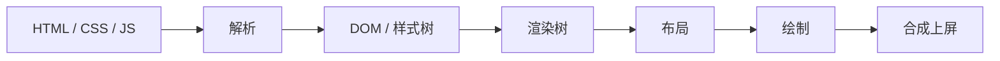
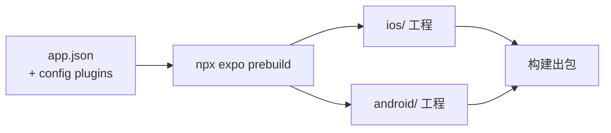

# 为什么我们用 React Native + Expo 做移动端

移动端技术选型：原理与取舍

<!--
今天讲一个选型问题：移动端为什么选 React Native 加 Expo，而不是 H5 或纯原生。重点讲原理，不教写代码；非前端同学也能跟上，用到的行话我都会现场解释。正文四十五分钟左右，最后留五分钟提问。
-->

---

## 今天的六章，串成一条论证链

  问题的本质→
  H5 的天花板→
  原生的成本→
  RN 的原理→
  Expo 的价值→
  RN 的边界

<!--
路线：先定义问题，然后排除两个方案——H5 为什么不够、纯原生为什么太贵；中间最重的一章讲 RN 凭什么两头占便宜；再讲 Expo 兜住哪些工程麻烦；最后讲边界。每章结尾我会收一句结论，中途走神了也能跟上。
-->

---
layout: section
---

# 一套业务，要同时进入两个封闭生态

<!--
先看局面：iOS 是 Swift 那套，Android 是 Kotlin 那套，两个生态互不认对方的代码；业务只有一套，还要每周往前走。移动端所有选型都在回答同一个问题：怎么用最少的人，把一套业务塞进两个封闭生态，还不拖慢迭代。
-->

---

## 所有界面技术都在回答同样两个问题

  
<b>① UI 由谁渲染</b><small>系统原生控件，还是网页引擎</small>

  
<b>② 逻辑跑在哪个运行时</b><small>原生运行时，还是 JS 运行时</small>

<!--
界面技术五花八门，剥开壳都在回答两个问题：屏幕上的按钮是谁画的——系统控件还是网页引擎；业务逻辑跑在哪——原生运行时还是 JS 引擎。答案一组合，所有方案都能放进一张图。这个框架记住，全场都用它定位。
-->

---

## 三条路线在这个坐标系里各占一角

  

    

    

    
UI： 系统控件

    
UI： 网页引擎

    
逻辑：JS 运行时

    
逻辑：原生运行时

    
<b>React Native</b><small>系统控件 · JS 逻辑</small>

    
<b>纯原生</b><small>系统控件 · 原生逻辑</small>

    
<b>H5 / WebView</b><small>网页引擎 · JS 逻辑</small>

  

<!--
纯原生在右上角，两个答案都是原生，体验天花板，代价第三章算。H5 在左下角，都选网页，成本最低，天花板下一章推。左上角的 RN 最有意思：UI 用系统控件，逻辑用 JS——明摆着想两头占便宜。今天全场就在论证这个「两头占」成不成立。
-->

---
layout: center
class: text-center
---

## RN 用 JS 描述界面，渲染出来的是真原生控件

  
<b>JS</b><small>描述界面</small>

  →
  
<b>React Native</b>

  →
  
<b>原生控件</b><small>系统渲染</small>

<!--
今天记住这一句就够本：RN 里没有网页，屏幕上每个按钮都是货真价实的原生控件，JS 只是发号施令的人。「JS 写的就是网页套壳」是今天要拆掉的最大误解——第四章拆给你看，最后还用系统工具现场验货。
-->

---
layout: section
---

# H5 的优点真实存在

<!--
先说 H5。很多人印象是「卡、假」，但它的好处实打实省钱，先把优点说足，才能准确说出它输在哪。
-->

---

## 一套代码两端运行，发版不经过商店

  

    
<b>一份 H5 代码</b>

    ↓
    

      
iOS

      
Android

      
浏览器

      
小程序

    

    
真跨平台

  

  

    
<b>改完部署</b>

    ↓
    
<b>用户打开即新版</b>

    
零审核 · 零等待

  

<!--
两大优点。真跨平台：一份代码处处能跑，今天讲的方案里唯一做到的。发版零成本：部署完用户打开就是新版，没有审核、没有「用户不肯升级」。运营活动页用它是碾压级优势。那为什么主流 App 的主体都不是 H5？答案在渲染链路里。
-->

---

## H5 的界面一变，就要重走浏览器渲染管线

WebView = 嵌在 App 里的浏览器；这条流水线为「渲染任意网页」设计——极通用，也极长

<!--
WebView 就是嵌在 App 里的浏览器。它干活的流程：解析成 DOM 和样式树、合成渲染树、算布局、绘制像素、合成上屏。这条流水线是为「渲染任意网页」设计的，极通用也极长；界面一变就要重走相应环节，每一步都有开销。
-->

---

## 一帧的预算只有 16.7 毫秒

浏览器里，JS 和渲染共用一个主线程。

  

    

    
16.7ms 预算线

    
流畅的一帧

    

      
JS

      
布局

      
绘制

      
合成

    

    
超时的一帧

    

      
JS 跑久了

      
布局

      
绘制

    

    
丢帧

  

<!--
屏幕一秒刷六十次，一帧预算十六点七毫秒，超时就丢帧，肉眼看到的就是卡顿。而且浏览器里 JS 和渲染挤同一个主线程，JS 一跑久整条管线跟着迟到。手机芯片弱还要省电，这条长管线经常踩线——「网页在手机上卡」是有物理来源的。
-->

---

## 系统自带的交互体验，H5 只能用 JS 模拟

  

    
复杂滚动交互<small>下拉刷新 · 嵌套滚动</small>

    
键盘避让

    
转场手势跟随

  

  

    

      →
      
<b>原生</b><small>系统自带，白送</small>

    

    

      →
      
<b>H5</b><small>JS 模拟，差一口气</small>

    

  

<!--
你在原生 App 里划列表，惯性和回弹是系统物理引擎在跑。H5 整页滚动系统也管，但交互一复杂——下拉刷新、嵌套滚动——就得 JS 自己模拟；键盘遮输入框是 WebView 经典 bug；iOS 边缘右滑返回那个跟手感，模拟出来总慢半拍。用户说不出所以然，但一上手就觉得「不像个 App」。
-->

---

## WebView 是一个沙箱，系统能力都在沙箱之外

  
<b>WebView 沙箱</b><small>网页 JS 被关在这里</small>

  

  

    
摄像头

    
推送

    
蓝牙

    
文件系统

  

墙是浏览器安全模型砌的——所以纯 H5 的 App 并不存在

<!--
更硬的一堵墙：浏览器天生不信任网页，把它关在沙箱里——摄像头、推送、蓝牙都碰不到。但正经 App 离不开这些。所以只要一个「H5 App」能扫码、能收推送，它就一定不是纯 H5，原生代码一定在场。这就是 Hybrid。
-->

---

## 所谓的「H5 App」，实际都是 Hybrid

  

    <b style="margin-bottom:.5rem">原生壳</b>
    

      
<b>WebView</b><small>H5 页面 + JS</small>

      

        
JSBridge

        
异步 · 字符串 · 无类型

        
⇄

      

      

        
摄像头

        
推送

        
蓝牙

      

    

  

<!--
Hybrid：原生壳管系统能力，WebView 跑页面，中间 JSBridge 通道让网页喊话。注意桥上三个标签——异步，要等回调；字符串，参数序列化传；无类型，全靠口头约定，一边改了另一边上线才发现。下一页看这三个标签变成多少工作量。
-->

---

## Hybrid 并没有省掉原生开发

  

    
原生写实现

    →
    
注册到桥

    →
    
JS 封装调用

    →
    
两端联调

  

  
每加一个能力走一遍；iOS 和 Android 的桥不同，各走一遍

<!--
每加一个原生能力：原生写实现、注册到桥、JS 封装、联调——iOS 和 Android 各来一遍。所以 Hybrid 团队照样要养原生工程师维护壳和桥。原生开发没省掉，只是挪了个位置。Hybrid 是务实折中，但没解决「两个生态两套人」的根本问题。
-->

---

## H5 适合嵌入页面，不适合承担 App 主体

  

    <b>App</b>
    

      
<b>主体验</b><small>首页 · 核心流程 · 高频交互</small>

      

        
运营页 H5

        
活动页 H5

        
帮助中心 H5

      

    

  

<!--
结论是分工：低频、重展示、天天改的页面给 H5，发版优势用在刀刃上；主体验——首页、核心流程、高频交互——管线开销、模拟不出的手感、隔桥的能力，三座山决定了不该是 H5。那纯原生呢？下一章算账。
-->

---
layout: section
---

# 同一个功能，永远要写两遍

<!--
纯原生这章短：不是技术问题，是经济问题。体验和能力都是天花板，账不划算。
-->

---

## 双份代码、双份团队、双份测试，还会互相漂移

  
<b>iOS</b><small>Swift · 团队 A · QA 一遍</small>

  

    
同一个需求

    
⇄

    
行为漂移

  

  
<b>Android</b><small>Kotlin · 团队 B · QA 再一遍</small>

<!--
同一个需求 Swift 写一遍 Kotlin 再写一遍：两拨工程师、两套招聘、QA 各回归一遍。还有对齐漂移：两边各自实现必然长歪，产品某天发现 iOS 有的功能 Android 没有，再补排期。人力乘二，速度除二。
-->

---

## 改一行代码，也要等商店审核

  

    
原生

    
打包

    →
    
<b>商店审核</b><small>iOS 通常 1~3 天</small>

    →
    
放量

    →
    
等用户升级

  

  

    
Web

    
部署

    →
    
分钟级全量

  

<!--
更要命的是节奏被商店锁死：打包、提审——iOS 通常一到三天，被拒重排——再分批放量、等用户升级。所以原生团队都攒版本，两周一班车，线上 bug 最快也是天级响应。记住这个「天」级基线，第五章拿它对照。
-->

---

## 我们想要的是：原生的体验，Web 的迭代速度

  
原生的体验

  +
  
一套 JS 代码

  +
  
随时发布

  →
  
<b>React Native？</b>

<!--
需求清单浮出来了：原生的体验、一套 JS 代码、最好还能随时发布。听着像既要又要还要——RN 的设计目标就是这张清单。前两条下一章看原理，第三条第五章揭晓。
-->

---
layout: section
---

# React 只负责计算界面，不负责渲染

<!--
全场最重的一章。讲 RN 前先把 React 说清楚，非前端同学给我一分钟。
-->

---

## React 的输出不是画面，是一份最小差异清单

  

    
<b>旧描述</b><small>数据 A 时的界面</small>

    
<b>新描述</b><small>数据 B 时的界面</small>

  

  →
  
<b>diff</b><small>对比</small>

  →
  
<b>最小差异清单</b><small>这行文字变了 那个按钮没变</small>

到这为止全是内存计算——真正「画」，是下游渲染后端的事

<!--
React 是描述界面的库：你声明数据长这样时界面该长那样；数据一变，它把新旧描述一比，算出最小差异清单。关键：到这为止全是内存计算，一个像素没画。画是下游「渲染后端」的事——而渲染后端，是可以整个换掉的。这就是 RN 的钥匙。
-->

---

## 同一个 React，换一个渲染后端

  

    
<b>React</b><small>diff 出界面变化</small>

    
↓

    
<b>ReactDOM</b>

    
↓

    
<b>DOM 节点</b><small>浏览器渲染</small>

    
网页

  

  

    
<b>React</b><small>diff 出界面变化</small>

    
↓

    
<b>React Native</b>

    
↓

    
<b>UIView · android.View</b><small>系统直接渲染</small>

    
手机

  

<!--
左边网页：React 算 diff，ReactDOM 落成 DOM，浏览器渲染。右边把 ReactDOM 换成 React Native：同样的 diff，落地变成给原生侧发指令——创建 UIView、改文字。没有 DOM、没有 WebView。锚点句现在有画面了。而且上层都是 React，前端经验直接平移。
-->

---

## 前端写的 flex 布局，由 C++ 引擎 Yoga 计算

  
flexDirection: 'row' justifyContent: 'center'

  →
  
<b>Yoga</b><small>C++ 实现的 Flexbox</small>

  →
  

    
iOS 布局

    
Android 布局

  

同一份实现，两端结果一致

<!--
布局谁算？原生控件不认识 CSS。RN 内置 Yoga——C++ 重新实现的 Flexbox，前端写惯的 flex 原样生效。C++ 算得快，而且两端跑同一份实现，布局结果完全一致。
-->

---

## 老架构里，三个线程隔着一座异步桥

  
<b>JS 线程</b><small>业务代码 · diff</small>

  

    
JSON 序列化 · 异步 · 攒批发送

    

      

      

    

    
桥（Bridge）

  

  

    
<b>Shadow 线程</b><small>Yoga 算布局</small>

    
<b>UI 主线程</b><small>创建控件 · 上屏</small>

  

<!--
指令怎么送到原生侧？老架构三个线程：JS 线程跑业务和 diff，Shadow 线程算布局，UI 主线程上屏。中间那座桥是唯一通道，规矩很怪：所有数据序列化成 JSON、全异步、攒批发。每次对话都要打包、排队、解包——什么场景会出事？
-->

---

## 桥上全是序列化消息，高频交互会拥堵

  
<b>触摸事件</b><small>原生侧产生</small>

  

    ⇄
    
桥：序列化 · 排队

    
每秒几十个来回

  

  
<b>JS 算新位置</b>

桥一堵，画面跟不上手指——老 RN「卡」的技术根源

<!--
高频交互。手指拖拽：触摸事件过桥给 JS，JS 算完过桥回原生，每秒几十个来回，每次都序列化排队。桥一堵画面跟不上手指——早年「RN 卡」的传闻就是这座桥。Meta 后来直接动手术，把桥拆了。
-->

---

## 新架构移除了桥，换成直通的 JSI

  
<b>JS 线程</b><small>业务代码 · diff</small>

  

    
<b style="font-size:.78rem">JSI</b><small>同步调用 · 零序列化</small>

    
JS 直接持有 C++ 对象引用

  

  

    
<b>Fabric</b><small>新渲染器</small>

    
<b>TurboModules</b><small>原生模块按需加载</small>

    
<b>UI 主线程</b><small>控件上屏</small>

  

RN 0.76 起（2024 年 10 月），新架构默认开启

<!--
手术核心叫 JSI：以前隔桥喊话，现在 JS 直接握着 C++ 对象引用，像调普通函数一样同步调，不序列化不排队。这张图和上一张同构，就是桥换成直通接口。配套 Fabric 新渲染器、TurboModules 按需加载。重点是时间点：0.76 起默认开启，2024 年 10 月——「RN 卡」的老印象，对应的是已经拆掉的那座桥。
-->

---

## Hermes 把 JS 提前编译成字节码

  

    
普通引擎

    
启动

    →
    
<b>现场解析 + 编译</b><small>白屏时间</small>

    →
    
执行

  

  

    
Hermes

    
<b>构建时已编译</b><small>字节码打进安装包</small>

    →
    
启动

    →
    
直接执行

  

启动快，内存省

<!--
还有 JS 引擎本身。一般引擎在用户打开 App 那刻现场解析编译，白屏就耗在这。Hermes 把编译挪到构建时，字节码直接打进包，启动加载即执行——启动快、内存省。RN 的运行时是为手机量身做的，不是把网页那套搬过来凑合。
-->

---

## 视图树是最直接的证据：里面没有一个 div

  

    UIWindow 
    &nbsp;└ RCTRootView 
    &nbsp;&nbsp;&nbsp;&nbsp;└ RCTViewComponentView 
    &nbsp;&nbsp;&nbsp;&nbsp;&nbsp;&nbsp;&nbsp;&nbsp;├ RCTParagraphComponentView 
    &nbsp;&nbsp;&nbsp;&nbsp;&nbsp;&nbsp;&nbsp;&nbsp;└ RCTViewComponentView
  

  

    
全是 UIView 子类

    
div：0 个

  

Xcode View Hierarchy / Android Layout Inspector：直接查看运行中 App 的真实视图层级

<!--
来点实证。（现场演示，控制在两分钟内）Xcode 掀开视图层级：RCTViewComponentView、RCTParagraphComponentView，全是 UIView 子类，找不到一个 div；Hybrid App 掀开就是一个大 WebView 节点。眼见为实。（演示前在自己 demo 里核对类名，老架构显示的是 RCTView、RCTText。）
-->

---

## 小结：JS 负责决定，原生负责呈现

  
<b>JS</b><small>决定界面怎么变</small>

  →
  
<b>JSI</b><small>同步送达</small>

  →
  
<b>Yoga</b><small>定位置</small>

  →
  
<b>系统控件</b><small>呈现</small>

体验是原生的，开发是 JS 的

<!--
串一遍：JS 决定界面怎么变，JSI 同步送达，Yoga 定位置，系统控件呈现。体验拿到原生，开发拿到 JS——原理成立。但原理成立到生产可用还差一堆脏活：RN 项目里躺着的两个原生工程谁维护？包在哪打？答案在 Expo。
-->

---
layout: section
---

# 官方建议通过框架使用 RN，Expo 是首选

Expo 之于 RN，相当于 Next.js 之于 React

<!--
RN 官网现在的入门指南，裸建已被挪进单独的 Without a Framework 页面，首页开篇就推荐通过框架用 RN，点名 Expo。类比前端：React 只管渲染，工程问题 Next.js 兜底——RN 和 Expo 同理。裸用会遇到什么？下页清单。
-->

---

## 直接使用 RN，就要自己维护两个原生工程

  

    your-app/ 
    &nbsp;├ src/&nbsp;&nbsp;&nbsp;&nbsp;&nbsp;&nbsp;← 你想写的 
    &nbsp;├ ios/&nbsp;&nbsp;&nbsp;&nbsp;&nbsp;&nbsp;← Xcode 工程 
    &nbsp;└ android/&nbsp;&nbsp;← Gradle 工程
  

  

    
装库要改 Podfile / Gradle

    
升级要手动 merge 模板 diff

    
打 iOS 包必须有 Mac

  

<!--
裸 RN 仓库里躺着完整的 Xcode 和 Gradle 工程，从生成那天起归你养：装库改 Podfile、升级对着模板 diff 手动 merge——这活没人想干两遍——打 iOS 包必须有 Mac。我们选 RN 图的就是不养原生团队，矛盾来了。Expo 用三层方案挨个拆。
-->

---

## Expo SDK 解决了原生模块的版本兼容问题

  

    <b>Expo SDK 53</b>
    

      
相机

      
推送

      
定位

      
文件系统

      
传感器

      
……

    

    <small style="margin-top:.4rem">与对应 RN 版本整体配套测试</small>
  

<!--
第一层：把相机、推送这些常用原生能力做成官方模块库，和 RN 版本捆成一个 SDK 版本，整体测过再发。升级从「赌兼容性」变成「SDK 52 升 53」。不性感，但省的全是真实工时。
-->

---

## 原生工程是生成产物，不是手写资产

CNG：原生目录不进仓库、不手改——脏了就删掉重新生成

<!--
第二层是 Expo 最核心的设计 CNG：原生工程根本不该由人维护。仓库里只有 JS 和一份 app.json；要原生工程时跑 prebuild 现场生成，地位等同编译产物，脏了删掉重来。升级噩梦直接消失——用新模板重新生成就完了。
-->

---

## 改原生配置，也只需要改 app.json

  
"plugins": [ &nbsp;&nbsp;"expo-camera" ]

  →
  
<b>prebuild</b><small>插件自动注入</small>

  →
  

    
Info.plist

    
AndroidManifest

  

全程不用打开 Xcode

<!--
库要改原生配置怎么办？config plugin：库作者把所需的原生改动写成插件，你在 app.json 里声明，prebuild 时自动注入。全程不用打开 Xcode，甚至不用知道 Info.plist 是什么。
-->

---

## 构建和签名交给云端，打 iOS 包不再需要 Mac

  
eas build

  →
  
<b>云端 Mac</b><small>prebuild · 编译 · 签名（证书托管）</small>

  →
  
<b>可提审的安装包</b>

团队里不再有「唯一能打包的那台电脑」

<!--
第三层：打包上云。一行命令，云端 Mac 替你生成工程、编译、签名，吐出可提审的包；证书托管。商业服务有免费额度，生产强度要付费——对比自己维护打包机和签名体系，这笔账好算。还剩一个大招：收第三章的伏笔。
-->

---

## App = 原生壳 + JS 包，两条独立的版本线

  

    <b style="margin-bottom:.4rem">手机上的 App</b>
    

      
<b>原生壳 v3</b><small>控件 · 模块 · JS 引擎 —— 走商店审核</small>

      
<b>JS bundle v7</b><small>业务逻辑 + 界面描述 —— 只是个文件</small>

    

  

<!--
RN App 的安装包分两部分：原生壳——控件、模块、JS 引擎，机器码必须走商店；JS bundle——业务代码，壳启动后加载执行。注意：改业务改界面，动的只是 bundle，而 bundle 本质是个文件。文件，是可以从服务器下载的。
-->

---

## OTA：启动检查、后台下载、下次启动生效

  

    <b style="margin-bottom:.3rem">手机</b>
    

      
原生壳 · runtime v3

      
JS bundle v7

    

  

  

    
runtimeVersion 匹配才下发

    
←

  

  

    <b style="margin-bottom:.3rem">更新服务</b>
    
新 bundle v8<small>要求 runtime v3</small>

  

纯 JS 改动走 OTA，分钟级；动了原生的更新，老实走商店

<!--
流程三步：启动时问服务器有没有新 bundle，有就后台下载，下次启动生效。安全阀 runtimeVersion：新 bundle 若用到壳里没有的模块会闪退，所以版本匹配才下发——纯 JS 走 OTA 分钟级，动了原生老实走商店。对照第三章：线上 bug 从「天」级到分钟级。合规：苹果允许 JS 层更新，前提不改变 App 核心用途，微软、Shopify 都在用。
-->

---

## 小结：RN 负责渲染，Expo 负责其余的工程化

  
<b>RN</b><small>JS 渲染原生 UI</small>

  +
  
<b>Expo</b><small>SDK · CNG · EAS · OTA</small>

<!--
分工一句话：RN 管「JS 渲染原生 UI」，Expo 管其余一切工程化。引擎和整车的关系——光有引擎开不上路，官方劝你别裸用就是这个原因。正面论证到此完成，还差最后一块：边界。
-->

---
layout: section
---

# 既然 RN 渲染原生控件，为什么大厂仍有原生团队？

<!--
最后一章从必然被问的问题开始：都是真原生控件了，为什么美团京东还有一大把原生工程师？剧透结论：不是 RN 不行，而是 RN 的设计从第一天就包含和原生共存。
-->

---

## 「用原生控件渲染」不等于「原生开发」

  

    
原生开发

    
代码

    →
    
系统

  

  

    
RN

    
JS 运行时

    →
    
通信层

    →
    
系统

  

链路罩不住的地方，就是原生的领地

<!--
先摆正认知：渲染用原生控件，不等于等价于原生开发。原生是代码直接跑在系统上；RN 是逻辑在 JS 运行时里，隔着一层通信。链路罩得住的地方 RN 都好使，罩不住的就是原生的领地——接下来三类。
-->

---

## 有些功能不运行在你的 App 进程里

  

    <b>你的 App 进程</b>
    

      
JS 引擎 + bundle

      
RN 界面

    

  

  

    
Widget · 灵动岛<small>独立进程</small>

    
推送扩展<small>独立进程</small>

    
手表 App<small>独立进程</small>

  

右边由系统单独拉起——你的 JS 不在场，不存在「用 RN 写」这个选项

<!--
最绝对的一类：Widget、灵动岛、推送扩展、手表 App，在系统眼里是独立小程序，由系统单独拉起。你的进程、JS 引擎、bundle 统统不在场——不是支持好不好，是物理上没有跑 JS 的地方。另外系统新 API 永远原生先能用。
-->

---

## 逐帧计算的场景，不适合放在 JS 里

  
<b>JS / RN</b><small>下指令：开滤镜</small>

  →
  

    <b>原生模块</b>
    

      
采集

      →
      
计算

      →
      
渲染

    

    <small>每秒 60 次，贴着硬件跑</small>
  

相机滤镜 · 音视频 · AR · 地图——热点下沉原生，界面骨架仍是 RN

<!--
性能热点：相机滤镜每秒几十帧逐帧算图像，这种活要贴着硬件写，JS 加跨语言通信不划算；地图 SDK 清一色原生，同理。注意姿势：不是不能用 RN，而是热点写成原生模块挂回 RN——骨架还是 RN 的，滤镜内部原生在算。
-->

---

## 存量架构与启动路径，天然属于原生

  

    

      <b>大厂 App</b>
      

        
原生页

        
RN 页

        
RN 页

        
原生页

      

    

    
嵌入形态：美团 MRN · 携程 CRN

  

  

    

      
点图标

      →
      
进程创建 · 壳初始化

      →
      
JS 就绪

    

    
启动前段只能是原生代码

  

<!--
历史和物理。大厂 App 是十年原生存量，没理由推倒重写，RN 是嵌进去的：这几页 RN、旁边那页原生，美团 MRN、携程 CRN 都是这形态——「大厂有原生团队」是存量决定的，不是 RN 不行。物理：点图标到 JS 就绪之间只能是原生代码在跑，极致的启动优化最终都在原生层。
-->

---

## 下沉不是妥协，是 RN 官方设计的通道

  

    <b style="margin-bottom:.4rem">你的 App</b>
    
<b>业务界面（JS / RN）</b><small>列表 · 表单 · 详情 · 流程——绝大部分</small>

    
↑ Native Module / Component 挂回 ↑

    

      
相机滤镜

      
音视频

      
地图

    

  

  
<b>系统扩展</b><small>Widget · 推送扩展 独立进程，不经过 RN</small>

<!--
把三页翻转过来——本章最重要的一页。看面积：绝大部分是业务界面，RN 主场；少数热点下沉成原生模块再挂回来；系统扩展在进程外。关键是下沉通道 Native Modules、Native Components 是官方一等公民机制。「有些功能用原生写」不是失败案例，是标准用法：默认 JS，热点下沉，挂回来继续跑。RN 设计的是分工，不是取代。
-->

---

## 有几类 App，从一开始就不该选 RN

  

    
游戏 · 重 3D 图形

    →
    
Unity / Unreal

  

  

    
榨干性能的专业工具

    →
    
纯原生

  

  

    
主体全在系统深水区

    →
    
纯原生

  

<!--
反面清单：游戏和重 3D，渲染管线就是产品，去用 Unity；榨干性能的工具，整个 App 都是热点，RN 层没剩什么；主体全在深水区，同理。判断标准就是上页那张图的面积比——业务界面占大头才选 RN，我们是典型前者。
-->

---

## 这些公司正在生产环境使用 RN

  

    
Shopify<small>全线押注</small>

    
Discord

    
Coinbase

    
微软 Office / Outlook

  

  

    
京东

    
美团<small>MRN</small>

    
携程<small>CRN</small>

  

国内三家都有自研 RN 基建体系

<!--
谁在用：Shopify 全线押注，Discord、Coinbase，微软 Office、Outlook 移动端大量用 RN、还维护着 RN 的 Windows/macOS 版本。国内京东、美团、携程各有自研基建——愿意投基建，说明极端体量下扛得住。共同画像：业务界面占大头、迭代压力大，跟我们一样。
-->

---

## Flutter 逐像素自绘，且官方不提供热更新

  

    
<b>JS + React</b>

    
↓

    
<b>React Native</b><small>指挥系统控件</small>

    
↓

    
<b>系统原生控件</b>

    
技能重叠前端 · 可 OTA

  

  

    
<b>Dart</b>

    
↓

    
<b>Flutter 引擎</b><small>自带渲染器</small>

    
↓

    
<b>自绘画布</b><small>每个像素自己画</small>

    
Dart 生态 · iOS AOT · 官方无热更新

  

<!--
为什么不是 Flutter？路线相反：RN 指挥系统控件，Flutter 自带引擎逐像素自绘，好处是两端像素级一致。两个代价对我们是决定性的：Dart 和前端技能栈零重叠；iOS 上 AOT 成机器码，官方不提供热更新——第三方 Shorebird 靠塞解释器绕，属少数派。技能复用和发布速度，恰是我们最看重的两条。
-->

---
layout: center
class: text-center
---

## 开头那两个问题，现在有答案了

  

UI 由谁渲染
→
系统原生控件

  

逻辑跑在哪个运行时
→
JS，一套代码

  

工程脏活谁兜底
→
Expo（CNG · EAS · OTA）

  

链路罩不住的地方
→
下沉原生，挂回 RN

<!--
回到开场。H5 都答网页，省钱但天花板低；纯原生都答原生，体验顶但成本翻倍、被审核锁死；RN 拆开答：渲染给系统控件，逻辑留 JS，Expo 兜工程，OTA 找回速度。后两行是一路走下来新加的两问，答案也在图上。一句话：用前端团队驾驭得了的一套代码，交付接近原生的体验，保住接近 Web 的迭代速度。
-->

---
layout: center
class: text-center
---

# Q&A

谢谢，欢迎提问与讨论

<!--
预答三个：性能——新架构后链路同步，热点走下沉；Meta 弃坑——Meta、微软、Shopify、Expo 多方共建；上手成本——主要是适应没有 DOM。其他现场聊。
-->
